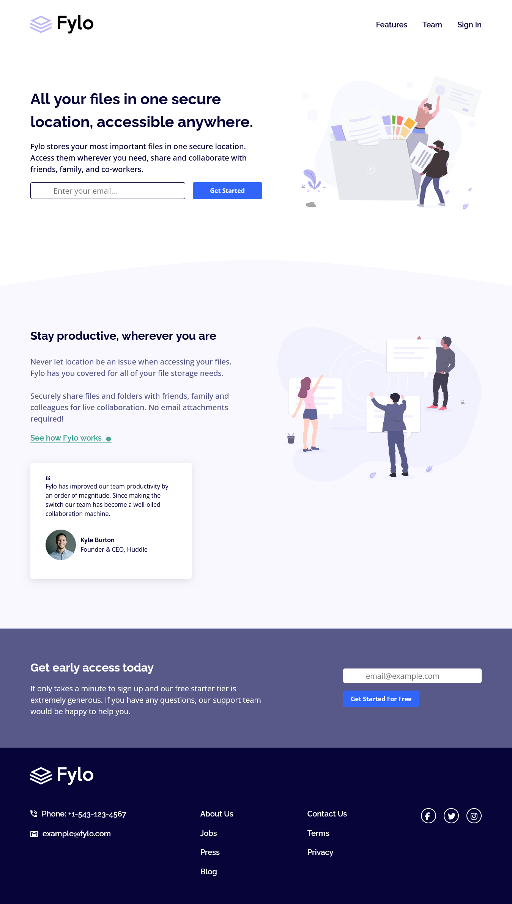

# Frontend Mentor - Fylo landing page with two column layout solution

This is a solution to the [Fylo landing page with two column layout challenge on Frontend Mentor](https://www.frontendmentor.io/challenges/fylo-landing-page-with-two-column-layout-5ca5ef041e82137ec91a50f5). Frontend Mentor challenges help you improve your coding skills by building realistic projects.

## Table of contents

- [The challenge](#the-challenge)
- [Screenshot](#screenshot)
- [Links](#links)
- [My process](#my-process)
  - [Built with](#built-with)
  - [Continued development](#continued-development)
- [Author](#author)
- [Acknowledgments](#acknowledgments)

## Overview

### The challenge

Users should be able to:

- View the optimal layout for the site depending on their device's screen size
- See hover states for all interactive elements on the page

### Screenshot

### Links

- Solution URL: [ solution URL](https://github.com/Malik-Muhammed/fylo-landing-page)
- Live Site URL: [ live site URL](https://malik-muhammed.github.io/fylo-landing-page/)

## My process

### Built with

- HTML5 markup
- CSS
- Flexbox
- Mobile-first workflow

### Continued development

- improvement on my mobile-first workflow
- improvement on my layout approach

## Author

- Frontend Mentor - [@Malik-Muhammed](https://www.frontendmentor.io/profile/Malik-Muhammed)
- Twitter - [@maliqlanre](https://www.twitter.com/maliqlanre)

## Acknowledgments

All thanks to Josh Comeau on his article on CSS Flexbox.
